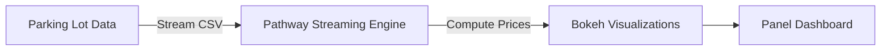

<h1>🚗 Dynamic Parking Pricing with Real-Time Visualization</h1>

<p>
A real-time dynamic pricing system for urban parking spaces, built entirely with <b>Python, Pandas, Numpy, Pathway, Bokeh, and Panel</b>. 
The project uses streaming data from multiple parking lots to compute smart, adaptive prices based on real-time occupancy, demand, traffic, and seasonality.
</p>

<hr>

<h2>📊 <u>Project Overview</u></h2>

<ul>
    <li>Real-time pricing for 14 urban parking spaces over 73 days of data.</li>
    <li>Data sampled every 30 minutes between 8:00 AM and 4:30 PM.</li>
    <li>Dynamic price adjustment based on occupancy, queue length, traffic, special events, vehicle type, and day-of-week seasonality.</li>
    <li>Visualizations for each parking lot and vehicle category using <b>Bokeh</b>.</li>
</ul>

<hr>

<h2>🛠 <u>Technology Stack</u></h2>

<ul>
    <li>Python 3</li>
    <li>Pandas & Numpy (data processing)</li>
    <li>Pathway (streaming data simulation and windowing)</li>
    <li>Bokeh (interactive plots)</li>
    <li>Panel (dashboard layout)</li>
</ul>

<hr>

## 🏗️ Project Architecture



<hr>

<h2>⚙️ Detailed Architecture & Workflow</h2>
<ul>
<li><strong>Parking Lot Data:</strong> Historical and simulated real-time data from 14 parking spaces. Includes occupancy, capacity, queue length, traffic conditions, vehicle type, and special event indicators.</li>
<li><strong>Pathway Streaming Engine:</strong> Streams CSV data at configurable rates. Applies window-based aggregation (daily tumbling windows). Computes demand, pricing, and seasonality effects.</li>
<li><strong>Pricing Logic:</strong> Multiple models compute prices dynamically (see below). Results streamed to visual dashboards.</li>
<li><strong>Bokeh Visualizations:</strong> Generates interactive time-series plots of parking prices. Separate plots for each vehicle type.</li>
<li><strong>Panel Dashboard:</strong> Combines all Bokeh plots into responsive web dashboards. Allows monitoring price behavior per parking lot and vehicle category.</li>
</ul>

<hr>

<h2>💵 Pricing Models Implemented</h2>

<h3>✅ Model 1: Baseline Linear Pricing</h3>
<p>Price increases linearly with occupancy levels.</p>
<pre>
Price = 10 + α * (MaxOccupancy - MinOccupancy) / Capacity
</pre>

<h3>✅ Model 2: Demand-Based Pricing with Seasonality</h3>
<p>Demand function incorporates:</p>
<ul>
<li>Occupancy</li>
<li>Queue length</li>
<li>Traffic conditions</li>
<li>Special events</li>
<li>Vehicle type</li>
</ul>
<p>Smooth weekly seasonality via sine wave on weekday. Vehicle-specific price multipliers for cars, bikes, trucks.</p>
<pre>
NormalizedDemand = α·(Occupancy/Capacity) + β·QueueLength - γ·Traffic + δ·SpecialDay

SeasonalityBoost = 0.1 * sin( (Weekday / 6) * 2π )

BasePrice = 10 * (1 + λ * NormalizedDemand)

FinalPrice = BasePrice * VehicleWeight * (1 + SeasonalityBoost)
</pre>

<hr>

## 🧉 Pricing Model Flow Diagram

```mermaid

graph TD
    A[Parking Lot Data Stream] --> B[Pathway Window Aggregation]
    B --> C[Model 1: Linear Pricing]
    B --> D[Model 2: Demand-Based Pricing with Seasonality]

    C --> E[Base Price Computation]
    D --> F[Demand Calculation]
    F --> G[Seasonality Boost (Sine Wave)]
    G --> H[Final Price with Vehicle Multiplier]

    E --> I[Bokeh Visualizations]
    H --> I[Bokeh Visualizations]
    I --> J[Panel Dashboard]

```


<h2>📈 <u>Visualization Features</u></h2>

<ul>
    <li>Interactive, real-time line plots of price evolution per parking lot.</li>
    <li>Separate plots for each vehicle type (car, bike, truck, etc.).</li>
    <li>Comparison with baseline pricing for transparency.</li>
</ul>

<hr>

<h2>📁 <u>Project Structure</u></h2>

<ul>
    <li><code>parking_stream_&lt;lot&gt;.csv</code>: Simulated stream data for each lot.</li>
    <li><code>dynamic_pricing.py</code>: Main streaming, pricing, and visualization code.</li>
    <li><code>README.html</code>: This project documentation.</li>
</ul>

<hr>

<h2>💡 <u>Potential Future Extensions</u></h2>

<ul>
    <li>Incorporate competitor pricing for price optimization.</li>
    <li>Vehicle rerouting suggestions when lots reach full capacity.</li>
    <li>More complex seasonal patterns (e.g., monthly, event-based).</li>
</ul>

<hr>

<h2>📝 <u>Contact</u></h2>

<p>For questions or collaboration, please reach out via GitHub issues or email.</p>
